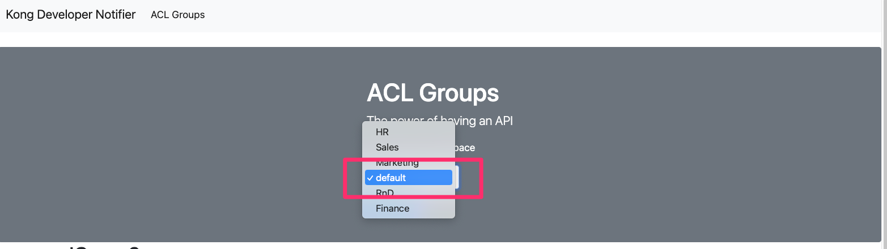
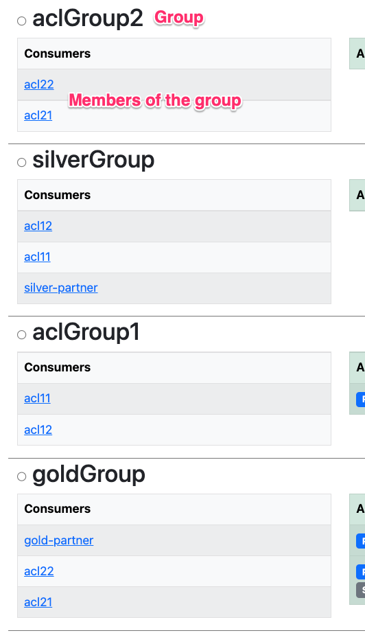
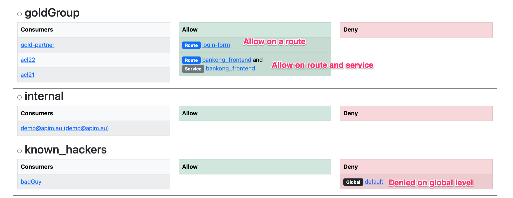
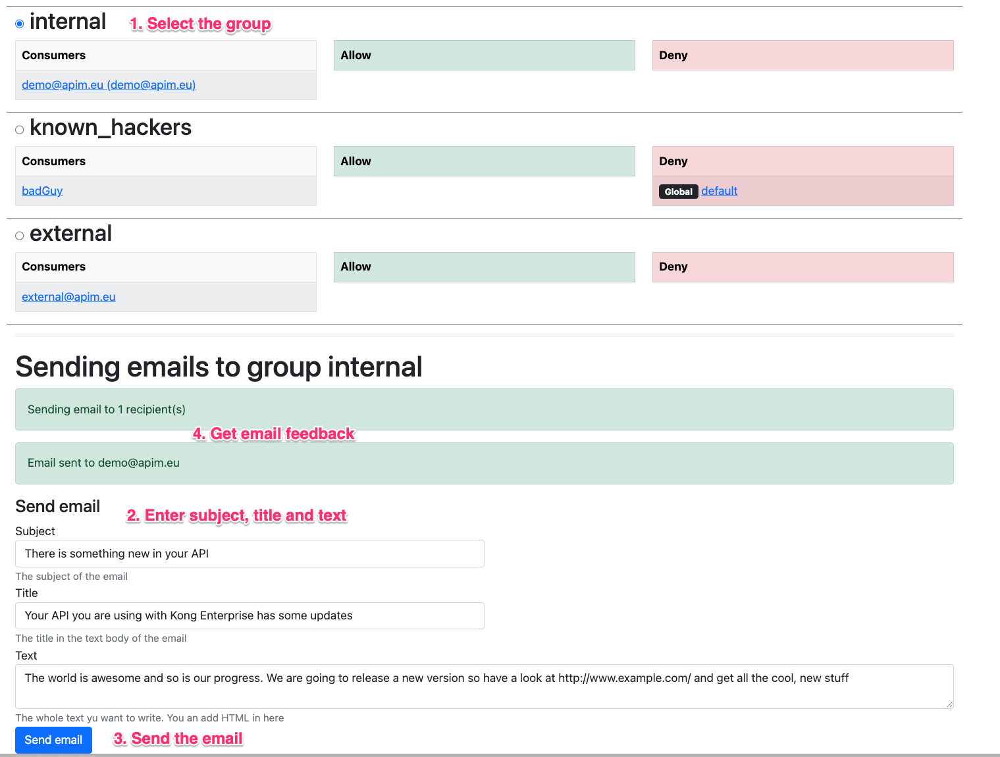

# Kong Notifier for developers

## About 
This web user interface has been built to provide some more visualization into the world of Kong ACL groups. It serves the following use cases:

1. Getting an overview on which ACL groups have been configured to all the consumers
2. Which consumers are attached to which ACL group
3. In which ACL plugin instance is this group being used as allow or deny (global, service and route)
2. Selecting an ACL group and send all members of this group an email (consumers need to have an email address in the username or custom_id)

## Installation

- Have a webserver with a recent PHP (tested PHP 7 and PHP 8)
- Put all files from the repo into a folder of this webserver
- copy the file `secrets-template.php` to `secrets.php` and change the settings in there (Kong connection and SMTP email server details) according to your setup

## Usage

### Workspaces

When opening the user interface in the browser you get a dropdown on the top to select the workspace (`default` is selected by default). 

### Memberships

Below that you get a list of all consumer groups having been attached to one or multiple consumers in that workspace:

### Plugin instances

For each group you are also getting an overview where this group is being enforced in your Kong setup (which ACL plugin instances reference that group):

### Sending email

You can send out an email to all members of one group (for example to notify them on updates) by selecting the checkbox in front of the group name and then filling out the form at the bottom (subject, title and text).

Note: This notifier will try to find an email-address either in the `username` or `custom_id`.